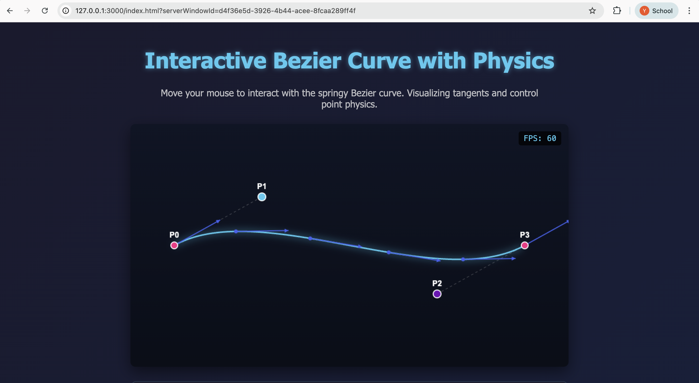
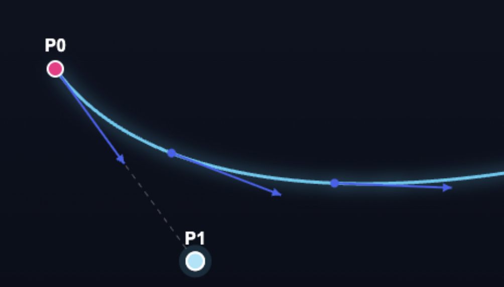
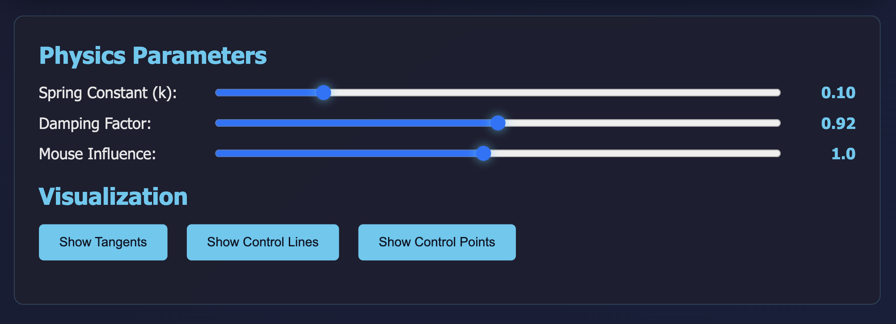

# 🌊 Interactive Bézier Curve with Physics

  

An interactive **cubic Bézier curve simulation** that behaves like a **springy rope**, built using **HTML5 Canvas** and **JavaScript**.

The curve responds to mouse input, visualizes tangents, and applies real-time spring-damping physics to its control points.

  

> 🔬 Built completely from scratch — no external libraries.

  

---

  

## ✨ Features

  

- Interactive cubic Bézier curve

- Physics-based motion (spring + damping)

- Real-time tangent vector visualization

- Mouse-controlled control points

- Adjustable physics parameters

- Toggleable visual elements

- Smooth animation (~60 FPS)

  

---

  

## 📸 Screenshots

  

### Curve & Control Points



  

### Tangent Visualization



  

### Physics Interaction



  

---

  

## 🎥 Demo Video

  

> 📌 *Upload a short demo video or GIF showing interaction.*

  

### YouTube / Drive Link

## 🎥 Demo Video

▶️ [Click here to watch the demo video](public/demo.mp4)


---

  

## 📐 Mathematical Model

  

### Cubic Bézier Curve

  

A cubic Bézier curve is defined by four control points:

  

$$B(t) = (1−t)³P₀ + 3(1−t)²tP₁ + 3(1−t)t²P₂ + t³P₃$$

  

Where:

-  ``P₀ and P₃`` – Fixed start point.

-  ``P₁ and P₂`` – Dynamic control points.

-  `t` – varies from 0 to 1 with a resolution of 100 segments by default.

  

The curve is rendered by sampling `t` values and connecting points.

  

---

  

### Tangent Vector

  

The tangent vector represents the direction of the curve at a point:

  

$$B'(t) = 3(1−t)²(P₁−P₀) + 6(1−t)t(P₂−P₁) + 3t²(P₃−P₂)$$

  

These vectors are normalized and visualized at t-values of **[0, 0.25, 0.5, 0.75, and 1].**

  
  

Tangents are:

- Normalized

- Scaled for visualization

- Rendered as arrow vectors

  

---

  

## ⚙️ Physics Model

  

### Spring–Mass–Damper System

  

Dynamic control points (**P₁ and P₂**) follow a spring-damping equation:

  

$$acceleration = -k * (position - target) - damping * velocity$$

  

Where:

-  `k` is the spring stiffness (user adjustable)

-  `damping` is the damping factor (user adjustable)

-  `target` is the rest position of the control point

- Integration is performed using Euler's method with a fixed timestep (1/60s)

  

This produces smooth, natural, rope-like motion.

  

---

  

## 🖱️ Interaction Logic

  

- Mouse movement influences control points

- Left half of canvas affects **P₁**

- Right half of canvas affects **P₂**

- Influence strength is position-dependent

- Prevents both points from snapping together

  

---

  

## 🎛️ Controls

  

### Physics Parameters

  

| Control | Description |

|------|------------|

| Spring Constant | Curve stiffness |

| Damping Factor | Oscillation decay |

| Mouse Influence | Interaction strength |

  

### Visualization Toggles

  

- Show / hide tangents

- Show / hide control lines

- Show / hide control points

  

---

  

## Design Choices & Features

### Real-time Interaction

- The simulation runs at 60 FPS using requestAnimationFrame

- Mouse input provides immediate visual feedback

  

### Visual Design

- Gradient background for depth perception

- Glow effects on the curve and control points for visual appeal

- Clear color coding:

-  **Pink**: Fixed control points (P₀, P₃)

-  **Cyan and Purple**: Dynamic control points (P₁, P₂)

-  **Blue**: Tangent vectors

  

### Interactive Controls

Users can adjust:

-  `Spring Stiffness`: Controls how quickly points return to rest

-  `Damping Factor`: Controls oscillation reduction

-  `Mouse Force`: Sensitivity of interaction

-  `Visualization Parameters`: Tangent length, curve resolution, point sizes

  

---

## Technical Implementation Details

### Code Structure

- **Canvas Setup**: Proper handling of device pixel ratio and resizing
- **Physics Engine**: Custom implementation without external libraries
- **Rendering Pipeline**: Optimized drawing calls for smooth animation
- **Event Handling**: Unified mouse/touch input system

### Performance Optimizations

- Fixed timestep physics for consistent behavior across frame rates
- Efficient curve sampling with adjustable resolution
- Minimal redraw regions (though full canvas clear for simplicity)

### Usage Instructions

- **Desktop**: Click and drag P₁ or P₂ to manipulate the curve
- **Adjust Parameters**: Use sliders to modify physics and visualization

  

## 🎨 Rendering Pipeline

  

Each animation frame performs:

  

1. Clear canvas with gradient background

2. Update physics simulation

3. Draw control lines 

4. Render Bézier curve

5. Draw tangent vectors 

6. Draw control points

7. Render mouse influence indicators

  

---

  

## 🚀 Performance

  

- Optimized animation loop using `requestAnimationFrame`

- Lightweight physics calculations

- FPS counter included

- Stable ~60 FPS on modern browsers

  

---

  

## 📂 Project Structure

```bash
├── public
├── index.html
├── script.js
├── style.css
```

---

  

## ▶️ How to Run

1. Clone the repository:

```bash
git clone https://github.com/NEO6667/Flam
```
Open index.html in any modern browser

(No build tools or dependencies required)


## 📚 Learning Outcomes

- Parametric curve mathematics
- Vector calculus & normalization
- Physics-based animation
- Interactive graphics programming
- Real-time system design